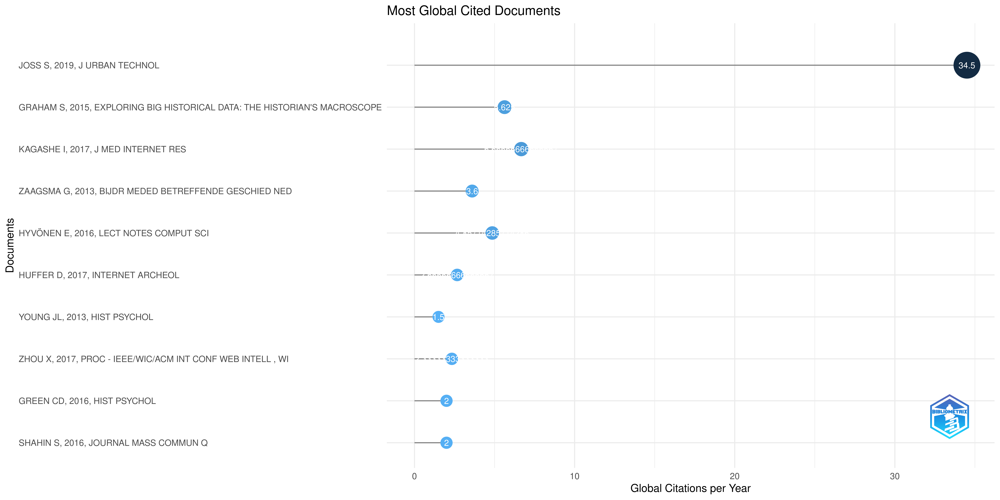

## Introdução

Este relatório é referente à segunda fase do plano de trabalho *Manutenção, criação e publicação de projetos de história digital: o caso do Programming Historian* da licença capacitação executada no Laboratório de Humanidades Digitais da FCSH-NOVA. São apresentadas aqui as etapas da pesquisa e os resultados alcançados entre 20 de julho de 23 de setembro de 2022.

Ao longo desses dois meses de trabalho foi realizado levantamento bibliográfico sobre o *Programming Historian* (doravante PH), análise das estruturas e workflow, assim como das diretrizes que formam o projeto. A pesquisa esteve centrada na versão em português do PH, porém não esteve restrita a ela.

Como resultados apresento uma série de relatórios que mapearam erros e apontam possíveis soluções - com destaque para a análise da estrutura de pastas dos quatro idiomas no repositório ph-submissions,  a proposta de Projeto Kanban para a versão em português, o conjunto de templates para issues e correções de erros e incoerências no site do PH - e uma breve análise do levantamento bibliográfico realizado.

Uma representação gráfica e textual de todas as alterações realizadas no repositório `git-gh_workflow` entre 20 de julho de 23 de setembro de 2022 pode ser acessada [aqui](git_log_full_graph.txt). Nesse arquivo estão registrados todos os commits realizados, sendo possível encontrar os dados completos sobre cada alteração. O arquivo foi gerado através do seguinte comando no Git[^1]:

```bash
$ git log --pretty=full --graph > git_log_full_graph.txt
```

Também é possível acessar uma versão em `csv` dos dados, clicando [aqui](git_log_oneline.csv). Essa versão mostra a *hash* abreviada do *commit*, o nome do autor, a data e o assunto. Esse arquivo foi gerado com o seguinte comando:

```bash
$ git log --date=format:'%Y-%m-%d %H:%M:%S'\
    --pretty=format:"%h,%an,%ad,%s" > git_log_oneline.csv
```

No decorrer do relatório, serão apresentados os resultados de cada etapa da pesquisa, assim como as principais conclusões e recomendações.

## Levantamento Bibliográfico

Buscando mapear as publicações que utilizaram as publicações do *PH*, estruturamos o levantamento bibliográfico em duas etapas:

1. Publicações que citam o *PH* em suas referências bibliográficas
2. Plublicações sobre o *PH*

### 1 - Publicações que citam o *PH* em suas referências bibliográficas

Buscamos publicações que contenham as palavras "programming historian" nas referências bibliográficas através do [Scopus](https://www.scopus.com). A seguir, listamos os parâmetros da busca e os resultados obtidos.

1. site: https://www.scopus.com
2. Logado com a conta de estudante da NOVA
3. data da busca: 2022-08-16
4. parâmetro: `REF ( "programming Historian" )`
5. Resultado: 130 documentos - todos podem ser consultados [aqui](scopus.bib)
    1. journal: 86
    2. conference proceedings: 25
    3. Book: 13
    4. book series: 6 

### 2 - Publicações sobre o *PH*

Buscamos publicações que contenham as palavras "programming historian" em seu título, através do Google Scholar. A seguir, listamos os parâmetros da busca e os resultados obtidos.

1. site: https://scholar.google.com.br
2. data da busca: 2022-08-04
3. parâmetro utilizado: `allintitle:"programming historian"`
4. Exclusão de citações
5. Resultados: 15 documentos - todos podem ser consultados [aqui](scholar.bib)

Todos as publicações encontradas foram armazenadas em formato `.bib` e também foram incluídas em uma coleção específica no *Zotero*. A coleção, assim como toda bibliografia restante que será utilizada nesse plano de trabalho, forma uma biblioteca pública de referências disponível para consulta on-line, intitulada *Biblioteca Programming Historian - publicações, diretrizes e documentação no Zotero* e pode ser acessada nesse [link](https://www.zotero.org/groups/4765521/programming_historian_-_publicaes_diretrizes_e_documentao/).

### Analisando os resultados

Devido ao caráter distinto das etapas e de suas publicações, estruturamos análises distintas para cada conjunto de publicações.

**Análise 1: Publicações que citam o *PH* em suas referências bibliográficas**

Esse conjunto de publicações e seus dados foram gerados a partir de busca no *Scopus* - os parâmetros e resultados gerais podem ser vistos [aqui](#1---publicações-que-citam-o-ph-em-suas-referências-bibliográficas). Utilizamos para sua análise uma ferramenta de tratamento de dados bibliográficos chamada `bibliometrix`[^2].

A ferramenta é de código aberto e desenvolvida como um pacote para a linguagem de programação R. Segundo os autores,

>The bibliometrix R-package (http://www.bibliometrix.org) provides a set of tools for quantitative research in bibliometrics and scientometrics. It is written in the R language, which is an open-source environment and ecosystem. The existence of substantial, effective statistical algorithms, access to high-quality numerical routines, and integrated data visualization tools are perhaps the strongest qualities to prefer R to other languages for scientific computation. (Aria e Cuccurullo, 2017, p. 963)

Através dela é possível percorrer as três etapas do fluxo de trabalho do mapeamento científico: *data collection*, *data analysis* e *data visualization*.

Inserimos os dados obtidos pelo *Scopus* em um *dataframe* e analisamos os dados com o *bibliometrix*, através da função `biblioshiny()`.

```{r}
library(bibliometrix)
biblioshiny()
```

Com essa função, podemos analisar os dados em um app de visualização em um browser. Segundo a página oficial do *bibliometrix*:

>It supports scholars in easy use of the main features of bibliometrix:
>
>Data importing and conversion to data frame collection
>
>Data gathering using Dimensions, PubMed and Scopus APIs  collection
>
>Data filtering
>
>Analytics and Plots for four different level metrics:
>
>    - Sources  
>    - Authors  
>    - Documents   
>    - Clustering by Coupling
>
> Analysis of three structures of Knowledge (K-structures):  
>
>    - Conceptual Structure  
>    - Intellectual Structure  
>    - Social Strucutre (sic)
>
> K-SYNTH. “Biblioshiny”. Bibliometrix. Acessado 17 de agosto de 2022. https://www.bibliometrix.org/home/index.php/layout/biblioshiny.

Buscamos gerar visualizações dos dados - assim como os dados tabulares, arquivados em formato `.csv` - para cada uma das categorias supracitadas.

As visualizações podem ser encontrados [aqui](bibliometrix/visualizations/) e os dados tabulares podem ser encontrados [aqui](bibliometrix/csvs).

Para essa análise preliminar, filtramos nosso data set para conter apenas artigos de periódicos.

É possível perceber o crescimento de publicações que referenciam o *PH* a partir de 2019, com destaque para o ano de 2021.


Os países dos autores com maior relevância nesse recorte foram EUA, Reino Unido, Canadá e Finlândia.


Entretanto, no que se refere às publicações, os números são mais equilibrados. Encontramos apenas dez publicações com mais de um artigo publicado.

"Sources","Articles"
"ACM INTERNATIONAL CONFERENCE PROCEEDING SERIES","3"
"DIGITAL HUMANITIES QUARTERLY","3"
"HISTORY OF PSYCHOLOGY","3"
"ACADIENSIS","2"
"BIJDRAGEN EN MEDEDELINGEN BETREFFENDE DE GESCHIEDENIS DER NEDERLANDEN","2"
"FOLIA LINGUISTICA","2"
"HISPANIA","2"
"INTERNATIONAL CONFERENCE ON ELECTRICAL ENGINEERING, COMPUTER SCIENCE AND INFORMATICS (EECSI)","2"
"INTERNATIONAL JOURNAL OF HUMANITIES AND ARTS COMPUTING","2"
"JOURNAL OF VICTORIAN CULTURE","2"


Nesse conjunto de dados, o autor mais relevante, ou seja, com o maior número de artigos publicados que citam o *PH* em suas referências é Ian Milligan, com 3.8% dos artigos.


E as filiações institucionais mais relevantes (contando mais de 1 ocorrência) são:

```
"Affiliation","Articles"
"UNIVERSITY OF WATERLOO","6"
"UNIVERSIDAD DE LA SALLE","4"
"YORK UNIVERSITY","4"
"AALTO UNIVERSITY","3"
"CALIFORNIA STATE UNIVERSITY","3"
"CARLETON UNIVERSITY","3"
"NOTREPORTED","3"
"UNIVERSITAT DE BARCELONA","3"
"UNIVERSITY OF SUSSEX","3"
"UNIVERSITY OF TEXAS AT AUSTIN","3"
```


Ao analisarmos os autores, países e documentos mais citados podemos ter uma noção de como o *PH* tem sido usado.

Autores mais citados:

Ian Milligan

Os países mais citados no trabalhos que referência o *PH* são Reino Unido, China...


Mais interessante é analisar os documentos mais citados nesses artigos:



As palavras mais relevantes no data set são: Digital Humanities e Digital History


Por fim, gostaria de destacar a rede de colaboração presente nesses 92 artigos. É notável uma centralização entre países da Estados Unidos, Canadá e países da Europa Ocidental, como Reino Unido, Alemanhã e Espanha.


Não busquei aqui dar conta de todas as possibilidades de uso e citação do *PH* na literatura de humanidades. Procurei realizar um mapeamento inicial com dados gerados pelo Scopus e analisá-lo com o apoio do bibliometrix buscando perceber alguma tendência. É possível concluir que, apesar do recente esforço de tornar o projeto multilinguístico, ainda percebemos que há uma centralidade em seu uso e citação em trabalhos publicados em revistas e por pesquisadores vinculadas a universidades dos países centrais do Norte capitalista. 

Ao mesmo tempo, percebemos que os trabalhos têm uma predominância de referências do Reino Unido.

**Análise 2: Publicações sobre o *PH***

Esse conjunto de publicações gerado pela busca no Google Scholar será analisado através de leitura próxima e servirão de base para as reflexões posteriores sobre o *PH*.

Utilizaremos o *QualCoder* para analisar as publicações [^3].

### Resultados

Conclusões?

**Biblioteca Programming Historian - publicações, diretrizes e documentação no Zotero**

Seu objetivo é organizar, categorizar e classificar criticamente a documentação do projeto Programming Historian presente no GitHub no Site e em um conjunto de publicações acadêmicas.

A biblioteca está organizada em duas subcoleções principais: Documentação e Publicações.

## Análise das estruturas, workflow e diretrizes do Programming Historian

### Site

### ph-submissions

### jekyll

### organization

### Propostas

[^1]: Para mais informações sobre o Git, consulte o [Manual do Git](https://git-scm.com/docs) e o livro [Pro Git](https://git-scm.com/book/pt-br/v2) de Scott Chacon e Ben Straub, especialmente o tópico [2.3 Fundamentos de Git - Vendo o histórico de Commits](https://git-scm.com/book/pt-br/v2/Fundamentos-de-Git-Vendo-o-hist%C3%B3rico-de-Commits).

[^2]: Aria, Massimo, e Corrado Cuccurullo. “Bibliometrix: An R-Tool for Comprehensive Science Mapping Analysis”. *Journal of Informetrics 11*, nº 4 (1º de novembro de 2017): 959–75. https://doi.org/10.1016/j.joi.2017.08.007.

[^3]: Curtain, C. (2022). QualCoder (3.0) [Python]. https://github.com/ccbogel/QualCoder/releases/tag/3.0 (Original work published 2019)