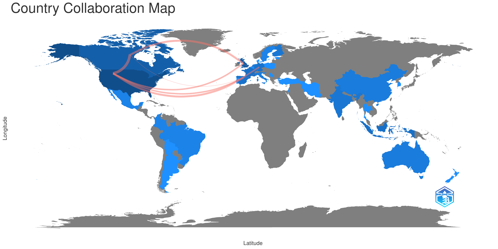

---
title: Relatório de pesquisa
subtitle: Análise do Workflow, Estrutura e Diretrizes do Programming Historian
author: Eric Brasil
date: 2022-10-03
abstract: Este relatório apresenta as etapas da pesquisa e seus resultados entre 20 de julho de 23 de setembro de 2022. Ao longo desses dois meses de trabalho foi realizado levantamento bibliográfico sobre o Programming Historian, análise das estruturas e workflow, assim como das diretrizes que formam o projeto. A pesquisa esteve centrada na versão em português do PH, porém não esteve restrita a ela. Como resultados apresento uma série de relatórios que mapearam erros e apontam possíveis soluções - com destaque para a análise da estrutura de pastas dos quatro idiomas no repositório ph-submissions,  a proposta de Projeto Kanban para a versão em português, o conjunto de templates para issues e correções de erros e incoerências no site do PH - e uma breve análise do levantamento bibliográfico realizado.
--- 
# Relatório da Análise do Workflow, Estrutura e Diretrizes do Programming Historian

Eric Brasil

## Introdução

Este relatório é referente à segunda fase do plano de trabalho *Manutenção, criação e publicação de projetos de história digital: o caso do Programming Historian* da licença capacitação executada no Laboratório de Humanidades Digitais da FCSH-NOVA. São apresentadas aqui as etapas da pesquisa e os resultados alcançados entre 20 de julho de 23 de setembro de 2022.

Ao longo desses dois meses de trabalho foi realizado levantamento bibliográfico sobre o *Programming Historian* (doravante PH), análise das estruturas e workflow, assim como das diretrizes que formam o projeto. A pesquisa esteve centrada na versão em português do PH, porém não esteve restrita a ela.

Como resultados apresento uma série de relatórios que mapearam erros e apontam possíveis soluções - com destaque para a análise da estrutura de pastas dos quatro idiomas no repositório ph-submissions,  a proposta de Projeto Kanban para a versão em português, o conjunto de templates para issues e correções de erros e incoerências no site do PH - e uma breve análise do levantamento bibliográfico realizado.

Uma representação gráfica e textual de todas as alterações realizadas no repositório `git-gh_workflow` entre 20 de julho de 23 de setembro de 2022 pode ser acessada [aqui](https://github.com/ericbrasiln/git-gh-workflow/blob/main/PH_workflow/git_logs/git_log_full_graph.txt). Nesse arquivo estão registrados todos os commits realizados, sendo possível encontrar os dados completos sobre cada alteração. O arquivo foi gerado através do seguinte comando no Git[^1]:

```bash
$ git log --pretty=full --graph > git_log_full_graph.txt
```

Também é possível acessar uma versão em `csv` dos dados, clicando [aqui](https://github.com/ericbrasiln/git-gh-workflow/blob/main/PH_workflow/git_logs/git_log_oneline.csv). Essa versão mostra a *hash* abreviada do *commit*, o nome do autor, a data e o assunto. Esse arquivo foi gerado com o seguinte comando:

```bash
$ git log --date=format:'%Y-%m-%d %H:%M:%S'\
    --pretty=format:"%h,%an,%ad,%s" > git_log_oneline.csv
```

No decorrer do relatório, serão apresentados os resultados de cada etapa da pesquisa, assim como as principais conclusões e recomendações.

## Levantamento Bibliográfico

Buscando mapear as publicações que utilizaram as publicações do *PH*, estruturamos o levantamento bibliográfico em duas etapas:

1. Publicações que citam o *PH* em suas referências bibliográficas
2. Publicações sobre o *PH*

### 1 - Publicações que citam o *PH* em suas referências bibliográficas

Buscamos publicações que contenham as palavras "programming historian" nas referências bibliográficas através do [Scopus](https://www.scopus.com). A seguir, listamos os parâmetros da busca e os resultados obtidos.

1. site: https://www.scopus.com
2. Logado com a conta de estudante da NOVA
3. data da busca: 2022-08-16
4. parâmetro: `REF ( "programming Historian" )`
5. Resultado: 130 documentos - todos podem ser consultados [aqui](https://github.com/ericbrasiln/git-gh-workflow/blob/main/bibliography/scopus.bib)
    1. journal: 86
    2. conference proceedings: 25
    3. Book: 13
    4. book series: 6 

### 2 - Publicações sobre o *PH*

Buscamos publicações que contenham as palavras "programming historian" em seu título, através do Google Scholar. A seguir, listamos os parâmetros da busca e os resultados obtidos.

1. site: https://scholar.google.com.br
2. data da busca: 2022-08-04
3. parâmetro utilizado: `allintitle:"programming historian"`
4. Exclusão de citações
5. Resultados: 15 documentos - todos podem ser consultados [aqui](https://github.com/ericbrasiln/git-gh-workflow/blob/main/bibliography/scholar.bib)

Todos as publicações encontradas foram armazenadas em formato `.bib` e também foram incluídas em uma coleção específica no *Zotero*. A coleção, assim como toda bibliografia restante que será utilizada nesse plano de trabalho, forma uma biblioteca pública de referências disponível para consulta on-line, intitulada *Biblioteca Programming Historian - publicações, diretrizes e documentação no Zotero* e pode ser acessada nesse [link](https://www.zotero.org/groups/4765521/programming_historian_-_publicaes_diretrizes_e_documentao/).

### Analisando os resultados

Devido ao caráter distinto das etapas e de suas publicações, estruturamos análises distintas para cada conjunto de publicações.

**Análise 1: Publicações que citam o *PH* em suas referências bibliográficas**

Esse conjunto de publicações e seus dados foram gerados a partir de busca no *Scopus* - os parâmetros e resultados gerais podem ser vistos [aqui](#1---publicações-que-citam-o-ph-em-suas-referências-bibliográficas). Utilizamos para sua análise uma ferramenta de tratamento de dados bibliográficos chamada `bibliometrix`[^2].

A ferramenta é de código aberto e desenvolvida como um pacote para a linguagem de programação R. Segundo os autores,

>The bibliometrix R-package (http://www.bibliometrix.org) provides a set of tools for quantitative research in bibliometrics and scientometrics. It is written in the R language, which is an open-source environment and ecosystem. The existence of substantial, effective statistical algorithms, access to high-quality numerical routines, and integrated data visualization tools are perhaps the strongest qualities to prefer R to other languages for scientific computation. (Aria e Cuccurullo, 2017, p. 963)

Através dela é possível percorrer as três etapas do fluxo de trabalho do mapeamento científico: *data collection*, *data analysis* e *data visualization*.

Inserimos os dados obtidos pelo *Scopus* em um *dataframe* e analisamos os dados com o *bibliometrix*, através da função `biblioshiny()`.

```{r}
library(bibliometrix)
biblioshiny()
```

Com essa função, podemos analisar os dados em um app de visualização em um browser. Segundo a página oficial do *bibliometrix*:

>It supports scholars in easy use of the main features of bibliometrix:
>
>Data importing and conversion to data frame collection
>
>Data gathering using Dimensions, PubMed and Scopus APIs  collection
>
>Data filtering
>
>Analytics and Plots for four different level metrics:
>
>    - Sources  
>    - Authors  
>    - Documents   
>    - Clustering by Coupling
>
> Analysis of three structures of Knowledge (K-structures):  
>
>    - Conceptual Structure  
>    - Intellectual Structure  
>    - Social Strucutre (sic)
>
> K-SYNTH. “Biblioshiny”. Bibliometrix. Acessado 17 de agosto de 2022. https://www.bibliometrix.org/home/index.php/layout/biblioshiny.

Buscamos gerar visualizações dos dados - assim como os dados tabulares, arquivados em formato `.csv` - para cada uma das categorias supracitadas.

As visualizações podem ser encontrados [aqui](./../biblography/bibliometrix/visualizations/) e os dados tabulares podem ser encontrados [aqui](./../biblography/bibliometrix/csvs).

É possível perceber o crescimento de publicações que referenciam o *PH* a partir de 2019, com destaque para o ano de 2021.


Os países dos autores com maior relevância nesse recorte foram EUA, Reino Unido, Canadá e Finlândia.


Entretanto, no que se refere às publicações, os números são mais equilibrados. Encontramos apenas dez publicações com mais de um artigo publicado.

|Sources|Articles|
|-------|--------|
|ACM INTERNATIONAL CONFERENCE PROCEEDING SERIES|3|
|DIGITAL HUMANITIES QUARTERLY|3|
|HISTORY OF PSYCHOLOGY|3|
|ACADIENSIS|2|
|BIJDRAGEN EN MEDEDELINGEN BETREFFENDE DE GESCHIEDENIS DER NEDERLANDEN|2|
|FOLIA LINGUISTICA|2|
|HISPANIA|2|
|INTERNATIONAL CONFERENCE ON ELECTRICAL ENGINEERING, COMPUTER SCIENCE AND INFORMATICS (EECSI)|2|
|INTERNATIONAL JOURNAL OF HUMANITIES AND ARTS COMPUTING|2|
|JOURNAL OF VICTORIAN CULTURE|2|


Nesse conjunto de dados, o autor mais relevante, ou seja, com o maior número de artigos publicados que citam o *PH* em suas referências é Ian Milligan, com 3.8% dos artigos.


E as filiações institucionais mais relevantes (contando mais de 1 ocorrência) são:

|Affiliation                  |Articles|
|-----------------------------|--------|
|UNIVERSITY OF WATERLOO|6|
|UNIVERSIDAD DE LA SALLE|4|
|YORK UNIVERSITY|4|
|AALTO UNIVERSITY|3|
|CALIFORNIA STATE UNIVERSITY|3|
|CARLETON UNIVERSITY|3|
|NOTREPORTED|3|
|UNIVERSITAT DE BARCELONA|3|
|UNIVERSITY OF SUSSEX|3|
|UNIVERSITY OF TEXAS AT AUSTIN|3|


Ao analisarmos os autores, países e documentos mais citados podemos ter uma noção de como o *PH* tem sido usado.

Autores mais citados:

|Authors|Articles|Articles Fractionalized|
|-------|--------|-----------------------|
|MILLIGAN I|5|1.84|
|AULIA A|3|0.83|
|HAKIEM N|3|0.83|
|HEINO E|3|0.46|
|KHAIRANI D|3|0.83|
|KOHO M|3|0.46|
|KRAUSE TB|3|3.00|
|LESKINEN P|3|0.46|
|TUOMINEN J|3|0.46|
|BAHAWERES RB|2|0.50|

O país mais citado no trabalhos que incluem o *PH* em suas referências é Reino Unido, com uma quantidade quatro vezes maior do que a China, a segunda colocada.


Abaixo, vemos os documentos mais citados nesses artigos:


É interessante avaliar quais as palavras com maior frequência nesse conjunto de dados. Ao olharmos para as palavras-chaves definidas pelos próprios autores, percebemos que *Digital Humanities* e *Digital History* se destacam.


Nos títulos, encontramos a seguinte frequência de palavras (simples):

|Terms|Frequency|
|-----|---------|
|digital|35|
|history|26|
|analysis|21|
|data|16|
|la|13|
|research|13|
|de|11|
|historical|9|
|social|9|
|humanities|8|

Já nos resumos, analisando os bigramas, encontramos:

|Terms|Frequency|
|-----|---------|
|digital humanities|45|
|social media|19|
|digital history|14|
|computational methods|11|
|machine learning|11|
|topic modelling|11|
|dependency distance|9|
|network analysis|8|
|text analysis|8|
|topic modeling|7|

Como podemos perceber, os dados de frequência de palavras nos títulos, resumos e palavras-chaves indicam que o *PH* tem sido referenciado em trabalhos cujo debate principal é a aplicação de métodos computacionais para a análise de dados históricos. Entretanto, a ausência de termos e bigramas relativos a temas e questões históricas mais específicas também nos indica que parte significativa desses trabalhos apresentam reflexões metodológicas e/ou teóricas sobre os usos de ferramentas e técnicas digitais, mas não representam trabalhos que apresentam resultados historiográficos a partir do seu uso.

É importante destacar também a rede de colaboração presente nesses 92 artigos. É notável uma centralização entre países da Estados Unidos, Canadá e países da Europa Ocidental, como Reino Unido, Alemanha e Espanha.



Por fim, gostaria de caracterizar a rede de co-citações de autores gerada a partir desse conjunto de dados. Podemos perceber com precisão três agrupamentos de co-citação. A primeira delas está centralizada pelos trabalhos de Graham, nomeadamente seu livro com Ian Milligan e Scot Weingart, *Exploring big historical data* (2015).

A segunda tem citações mais bem distribuídas e podemos perceber um conjunto de autores bastante ligado ao *PH*, como Adam Crymble, James Turkel, o próprio Ian Milligan e autores importantes para as Humanidades Digitais como Roy Rosenzwieg, Dan Cohen e Moretti.

O terceiro agrupamento apresenta  autores variados e demanda uma análise mais detalhada que não cabe no escopo desse relatório.


Não busquei aqui dar conta de todas as possibilidades de uso e citação do *PH* na literatura de humanidades. Procurei realizar um mapeamento inicial com dados gerados pelo *Scopus* e analisá-lo com o apoio do bibliometrix buscando perceber alguma tendência. É possível concluir que, apesar do recente esforço de tornar o projeto multilinguístico, ainda percebemos que há uma centralidade em seu uso e citação em trabalhos publicados em revistas e por pesquisadores vinculadas a universidades dos países centrais do Norte capitalista. 

Os dados e reflexões iniciais servirão de base para um futuro paper.

**Análise 2: Publicações sobre o *PH***

Esse conjunto de publicações foi gerado pela busca no Google Scholar descrita anteriormente e não consiste em uma revisão de literatura extensiva, mas sim uma primeira aproximação com o tema, buscando compreender como o *PH* aparece em uma busca simples em um dos mais populares buscadores disponíveis atualmente.

Esse conjunto de artigos foi analisado através de leitura próxima através do software *QualCoder* para analisar as publicações [^3].

Foram criado códigos buscando mapear metadados e o conteúdo dos artigos. 

Importante notar que entre os códigos referentes à análise do conteúdo, os mais relevantes são àqueles relacionados aos aspectos técnicos e às diretrizes editoriais, seguidos por debates acerca do caráter multilinguístico do projeto.

|Código|Total|
|------|-----|
|PH::TECHNICAL_ASPECTS|25|
|PH::EDITORIAL_PRACTICES|14|
|PH::MULTILINGUISM|11|
|PH::CRITICAL_MAKING|9|
|PH::TRANSLATION|8|
|PH::OPENNESS|6|
|PH::CRITICS|5|
|PH::COMUNITY|4|
|PH::ESPANHOL|4|
|PH::METHODOLOGY|4|
|PH::GENDER|3|
|PH::LESSONS|2|
|PH::NOVICE-FRIENDLY|1|

Para acessar os dados completos da codificação, ver [esse arquivo](bibliography/qualcoder/../../../bibliography/qualcoder/Code_frequencies_0.csv)

Aqui também percebemos, como no tópico anterior, que os debates principais dos artigos recaem sobre os aspectos técnicos e metodológicos do *PH*, e praticamente não encontramos produções sobre temas e problemas da historiografia. Entretanto, nesse caso, isso era de se esperar pelo caráter da busca realizada. Ao encontrar trabalhos cujo título possuía a expressão "programming historian", o conjunto de dados estaria sobremaneira direcionado para a reflexão acerco do caráter do próprio projeto.

**_Biblioteca Programming Historian - publicações, diretrizes e documentação_ no Zotero**

A partir dos dados produzidos nessa etapa de levantamento bibliográfico, foi criada uma biblioteca de referências no Zotero intitulada [*Programming Historian - publicações, diretrizes e documentação*](https://www.zotero.org/groups/4765521/programming_historian_-_publicaes_diretrizes_e_documentao/).


Seu objetivo é organizar, categorizar e classificar criticamente a as publicações acadêmicas aqui trabalhadas, mas também incluir toda a documentação do projeto Programming Historian presente no GitHub no Site, que foram analisadas e categorizadas na fase dois dessa pesquisa (e serão detalhadas no próximo tópico).

O *Zotero* é "uma ferramenta livre, fácil de usar para ajudá-lo a coletar, organizar, anotar, citar e compartilhar sua pesquisa"[^4]. A ferramenta nos permite, portanto, gerenciar referências bibliográficas e desenvolver variadas estratégias de organização e análise, além de possibilitar o compartilhamento dos dados em bibliotecas colaborativas on-line.

A biblioteca relativa à essa pesquisa está organizada em duas subcoleções principais: *Documentação* e *Publicações*. Foram criadas subcoleções e etiquetas organizadoras, que podem servir de filtro em buscas, assim como, os itens relativos à documentação receberam notas explicativas e de erros/sugestões.

## Análise das estruturas, workflow e diretrizes do Programming Historian

O Programming Historian possui atualmente versões em quatro idiomas, inglês, espanhol, francês e português. Para o funcionamento e manutenção de uma empreitada desse porte, existe um robusto volume de diretrizes e políticas de publicação, workflow e documentação condensadas no [site do projeto](https://programminghistorian.org) e nos repositórios vinculados à sua organização no GitHub[^org-gh].

Nesse tópico, busco apresentar a análise realizada sobre essa estrutura. Os objetivos são entender seu funcionamento, caracterizar a estrutura e fluxo de trabalho e mapear incoerências e erros, para então propor encaminhamentos de melhorias e/ou soluções.

Para tanto, utilizei um método de organização e análise a partir de recursos do Zotero. Criei, conforme indicado anteriormente, subcoleções específicas para a documentação do *PH* e a partir dela, criei etiquetas e notas, vinculando documentos e notas quanto necessário.

As subcoleções foram criadas a partir da própria estrutura dos repositórios da organização *PH* no GitHub, e do site do projeto. As subcoleções criadas foram:

- Site: referente ao próprio site do projeto, contendo as seguintes subcoleções: `Apoiar`, `Contribuir`, `Questões Técnicas` e `Sobre`.[^site]
- GH_ORG: referente ao perfil da organização _The Programming historian_ no GitHub
- GH_ph-submissions: referente ao repositório _ph-submissions_
- GH_jekyll: referente ao repositório _jekyll_. Também criamos uma subcoleção específica para a _Wiki_ do projeto, que está no repositório _jekyll_.

Um conjunto de etiquetas (*tags*) foi criado para a análise, organização e filtro dos itens. Criei etiquetas primárias, que possibilitam um filtro temático mais geral. São elas: `Site`, `GitHub`, `ph-submission`, `jekyll`, `Wiki`, `Erro/Sugestão`. Posteriormente foram criadas etiquetas secundárias, que estão vinculadas mais diretamente a cada subcoleção ou temas específicos.  A lista é longa e pode ser consultada na [biblioteca no Zotero](https://www.zotero.org/groups/4765521/programming_historian_-_publicaes_diretrizes_e_documentao/).

O site do Programming Historian é um site estático baseado em Jekyll[^jekyll], cujo conjunto de dados e arquivos está hospedado no repositório programminghistorian/jekyll[^jekyll-gh]. O site é gerado a partir desses arquivos e dados (a maioria escritos em linguagem de marcação Markdown), e hospedado no GitHub Pages[^gh-pages]. 

A complexidade e sofisticação técnica e estrutural para a manutenção de um site multilinguístico que permita sua constante atualização e expansão, seja com a publicação de novas lições e traduções nos quatro idiomas, seja com a incorporação de novos colaboradores ao longo do tempo, é um desafio que tem sido enfrentado pelo projeto nos últimos anos. Nas palavras de Lincoln e colaboradores (2022),  

>Throughout the process of onboarding new editors from multiple backgrounds and publishing lessons in several languages, both originals and translations, the team came to discuss ways to better reach our global audience and enhance language accessibility. These goals have relied on the malleable Jekyll-based site to create a more accessible journal, but have also tested the limits of both the technology as well as our team’s processes.[^lincoln] 

Ao enfrentarem o desafio da expansão para vários idiomas, respeitando as diretrizes do projeto de democratização do acesso ao conhecimento, a equipe técnica precisou desenvolver uma arquitetura técnica que garantisse seu funcionamento e ao mesmo tempo simplificasse o fluxo de trabalho dos editores, autores e tradutores. Isso gerou, consequentemente, o aumento da complexidade dos fluxos de trabalho da equipe técnica, ou seja, houve uma realocação da complexidade e do trabalho ue envolve (LINCOLN et al, 2022, par. 6).

Os autores entendem esse processo nos marcos do que Matt Ratto chama de "critical making", definido como:

>“connect[ing] two modes of engagement with the world that are often held separate — critical thinking, typically understood as conceptually and linguistically based, and physical ‘making,’ goal-based material work” (Ratto 2011, 253 apud Lincoln et al, 2022).

E eles concluem:

>For PH, creating and maintaining a multilingual publication is an act of critical making, negotiating the complexities of language and the constraints of our infrastructure in both technology and labor (LINCOLN et al, 2022, par. 5).

Compreendendo a complexidade dessa arquitetura, que envolve além da equipe técnica, todos os membros e colaboradores do projeto, engloba tanto os arquivos em markdown presentes nos repositórios do *PH* no GitHub, quanto arquivos responsáveis pela geração do site, testes e conferências de conflitos, pretendo caracterizar esse processo e listar erros e incoerências encontradas e sugerir correções e melhorias.

### Site

Ao acessar o site [programminghistoria.org](https://programminghistorian.org/), o usuário é direcionado para a página inicial, que apresenta as opções acessar o *PH* em cada um dos quatro idiomas atualmente disponíveis: inglês, espanhol, francês e português.

O site é atualizado constantemente a partir das alterações realizadas no repositório [programminghistorian/jekyll](https://github.com/programminghistorian/jekyll) quando um novo commit é realizado através de um Pull Request (PR). Portanto, erros podem ser corrigidos facilmente e atualizações são efetuadas com rapidez. O workflow desse processo é explicado detalhadamente [no tópico *Fixing Content on the site* na página *Making technical contribution* da Wiki do projeto](https://github.com/programminghistorian/jekyll/wiki/Making-Technical-Contributions#fixing-content-on-the-site).

Resumidamente, é necessário abrir uma *issue* no repositório [programminghistorian/jekyll](https://github.com/programminghistorian/jekyll/issues) explicando o erro e as alterações pretendidas e designar responsáveis. O segundo passo é criar um novo branch no repositório com o nome da issue e realizar as alterações nesse branch.

Após as alterações terem sido realizadas, é necessário abrir um Pull Request, preencher o template, marcar as equipes ou usuários relacionados à issue, e designar um revisor para o PR.

Caso o PR não apresente conflitos e o revisor aprove, é possível realizar o *merge* e o site será atualizado automaticamente.

Os erros e sugestões referentes ao site podem ser encontradas [aqui](./erros_sugestoes/Site/). A lista de propostas de correções e melhorias que serão convertidas em issues e PR no repositório jekyll podem encontradas no tópico [Propostas](#propostas).

### ph-submissions

O repositório [programminghistorian/ph-submissions](https://github.com/programminghistorian/ph-submissions) reúne todos os arquivos e diretrizes relacionadas às propostas de lições novas e traduções. 

O workflow desse processo é realizado por completo na página de _issues_, sendo organizadas por etiquetas (labels), responsáveis (assignees) e revisores (reviewers). Assim os procedimentos são abertos e cada alteração é registrada e as versões devidamente controladas.

De forma resumida, o fluxo consiste em:

1. O autor entra em contato com o Editor-chefe do idioma específico, e envia o [formulário de proposta de lição](https://programminghistorian.org/assets/forms/formulario.proposta.licao.txt) preenchido ou a proposta de lição a ser traduzida.
2. Caso seja aprovada, o Editor-chefe designa um editor para a lição/tradução. E este criará uma _issue_ no repositório para receber e acompanhar a proposta. O prazo para envio da lição é de 90 dias após a criação da _issue_.
3. Após a submissão da proposta, o editor entrará em contato com revisores e inicia o processo de revisão com a criação de um issue específica para o tal. 
4. OS editores devem cumprir uma série de tarefas técnicas importantes para a publicação da lição: verificar nomes dos ficheiros e das imagens, datasets e vídeos/gfs; editar os metadados e editar o front matter YAML da lição, entre outras. O processo detalhado e as tarefas do editor podem ser encontradas [aqui](https://programminghistorian.org/pt/directrizes-editor).

O caráter aberto e colaborativo, e que utiliza o controle de versões, é um destaque no processo de avaliação e publicação pelo *PH*, garantindo a implementação de uma política de ciência aberta eficiente. Entretanto, o fluxo constante de submissões e revisões de lições e traduções, simultaneamente em quatro idiomas, torna complexo o rastreamento e visualização das tarefas, etapas e demandas de cada editor e equipe de idioma. As etiquetas ajudam a filtrar e visualizar a lista de lições, mas com o crescente número de issues abertas e sua variedade, não são suficientes. Assim, foram criados projeto de quadro *Kanban* no GitHub para as equipes em inglês, francês e espanhol vinculados ao repositório [jekyll](https://github.com/programminghistorian/jekyll/projects?type=classic). Um quadro nesse modelo é uma ferramenta importante para a gestão do fluxo de trabalho para a equipe em português. Nesse sentido, propus a sua criação na [issue #2670](https://github.com/programminghistorian/jekyll/issues/2670) e os debates avançaram para uma nova proposta de criação de um único Projeto *Kanban* para todas as equipes de idiomas. Um detalhamento dessa proposta pode ser encontrado [aqui](./erros_sugestoes/jekyll/sugestao_jekyll_projects.md).

Ao analisar a estrutura e fluxo de trabalho nesse repositório, foram identificadas algumas questões que merecem atenção. 

1. Estrutura de pastas dos idiomas: `en`, `pt`, `es`, `fr`. Essa estrutura apresenta incoerências que dificultam a compreensão e manutenção do repositório. Cada pasta de idioma está atualmente com um conjunto de subpastas específico, e por isso proponho uma padronização geral. Abaixo, a proposta de nova estrutura para as pastas:

    ```
    en/es/fr/pt
    ├── drafts/borradores/en-cours/rascunhos
    │   ├── originals/originales/originales/originais
    │   └── translations/traducciones/traductions/traducoes
    ├── published/publicadas/publiees/publicadas
    │   ├── originals/originales/originales/originais
    │   └── translations/traducciones/traductions/traducoes
    ├── README.md
    └── translation-list.md/lista-de-traducciones.md/liste-traductions.md/lista-de-traducoes.md
    ```

Uma avaliação mais detalhada da proposta pode ser encontrada [aqui](./erros_sugestoes/ph-submissions/ph-submissions_folder_analyzis.md). 


2. O ficheiro [index.html](https://github.com/programminghistorian/ph-submissions/blob/gh-pages/index.md) foi atualizado pela última vez há cinco anos. E não condiz com o README.md do repositório [ph-submissions](https://github.com/programminghistorian/ph-submissions/blob/gh-pages/README.md).

3. Não há política de proteção do branch `gh-pages`.

4. Issue Templates: está apenas em inglês e parece desatualizado. Seria importante, pensando a automatização e redução das etapas de trabalho para editores, seguindo a proposta de Lincoln (2022) e colaboradores par realocar a complexidade dos processos [^lincoln], a criação de um conjunto de templates que contemple os quatro idiomas. Uma proposta geral de templates pode ser encontrada [aqui](erros_sugestoes/ph-submissions/issue_templates_proposal.md).

### jekyll

O repositório jekyll hospeda todos os arquivos relativos ao site do *PH* e os principais debates, discussões e propostas do projeto (através da página de [issues](https://github.com/programminghistorian/jekyll/issues/).

As alterações e commits realizados nele precisam ser aprovadas por algum revisor, e passar nos testes automáticos no GitHub. O repositório possui um workflow de integração contínua que executa testes de validação de código e de links para que não haja erros na publicação do site após a aceitação das alterações propostas.

Destaco três questões para avaliação:

1. Contributing.md: O documento foi atualizado pela última vez em maio de 2017 (Latest commit [0389b43](https://github.com/programminghistorian/jekyll/commit/0389b438144dcc6fe8b87360982771fb297ec89a) on 6 May 2017) e ainda consta o nome de Amanda Visconti como Ombudsperson. Não constam os nomes dos Ombudsperson da equipe em francês e português.
2. Issue Template: O modelo foi atualizado pela última vez em 2016 (Latest commit [4a8ad0f](https://github.com/programminghistorian/jekyll/commit/4a8ad0f3c4069221c5ea9af18ce36345588a9669) on 27 Jun 2016) e sua sintaxe está fora do padrão atual do GH. Proponho uma atualização que pode ser vista [aqui](./../PH_workflow/erro_sugestoes/jekyll/sugestao_jekyll_issue_template.md).
3. Projetos Kanban para idioma português: essa questão foi endereçada na [issue #2670](https://github.com/programminghistorian/jekyll/issues/2670).

### organization

O perfil da organização Programming Historian no GitHub é a página inicial onde estão listados os repositórios e demais informações, como equipe, colaboradores, projetos, etc.

1. Não há README.md para a organização (nem público nem privado). Seria uma opção interessante para tornar a página inicial da organização no GH mais profissional.
2. Não há indicação do perfil do twitter do PH
3. Criação de um Project Kanban reunindo todos os idiomas vinculado diretamente na organização: essa questão foi endereçada na [issue #2670](https://github.com/programminghistorian/jekyll/issues/2670) e em reunião com Anisa Hawes.

### Propostas

1. Site

- [ ] Criar **Issue A** no programminghistorian/jekyll: Correção de erros de links nas diretrizes para tradutores em português. [Ver descrição](./../PH_workflow/erros_sugestoes/Site/Erros%20-%20Contribua.md)
  - [ ] Criar **Branch "Issue-A** no programminghistorian/jekyll e realizar alterações. 
  - [ ] Criar **Pull Request** do branch "Issue-A" no programminghistorian/jekyll e solicitar revisão.
- [ ] Criar **Issue B** no programminghistorian/jekyll: Inclusão e correção de links na pagina Contribua e Diretrizes para editores nos quatro idiomas. Ver descrição [aqui](./../PH_workflow/erros_sugestoes/Site/Erros%20-%20Diretrizes%20para%20tradutores.md) e [aqui](./../PH_workflow/erros_sugestoes/Site/Erros%20-%20Diretrizes%20pra%20editores.md)
  - [ ] Criar **Branch "Issue-B** no programminghistorian/jekyll e realizar alterações.
  - [ ] Criar **Pull Request** do branch "Issue-B" no programminghistorian/jekyll e solicitar revisão.

1. ph-submissions

- [x] Proposta de reestruturação das pastas de idiomas: reunião com Anisa Hawes para apresentação da [proposta](erros_sugestoes/ph-submissions/ph-submissions_folder_analyzis.md).
- [ ] Proposta de criação de conjunto de templates para issues: 
  - [x] reunião com Anisa Hawes para apresentação geral do tema.
  - [x] Criação de [repositório de exemplo](https://github.com/ericbrasiln/issue_templates_test) com a [proposta](erros_sugestoes/ph-submissions/issue_templates_proposal.md) já definida para avaliação.
  - [x] Convidar Anisa Hawes para ser colaboradora no repositório de exemplo.
  - [ ] Criar **Issue C** no programminghistorian/ph-submission com a proposta
  - [ ] Criar **Branch "Issue-C** no programminghistorian/ph-submission e realizar a alteração nos arquivos.
  - [ ] Criar **Pull Request** do branch "Issue-C" no programminghistorian/ph-submission e solicitar revisão. 

3. jekyll
   
- [ ] Criar **Issue D** no programminghistorian/jekyll: Atualização do documento Contributing.md. [Ver proposta](erros_sugestoes/jekyll/sugestao_jekyll_contributing.md)
  - [ ] Criar **Branch "Issue-D** no programminghistorian/jekyll e realizar alterações.
  - [ ] Criar **Pull Request** do branch "Issue-D" no programminghistorian/jekyll e solicitar revisão.
- [ ] Criar **Issue E** no programminghistorian/jekyll: Atualização do modelo de issue template. [Ver proposta](erros_sugestoes/jekyll/sugestao_jekyll_issue_template.md)
  - [ ] Criar **Branch "Issue-E** no programminghistorian/jekyll e realizar alterações.
  - [ ] Criar **Pull Request** do branch "Issue-E" no programminghistorian/jekyll e solicitar revisão.

4. organization

- [x] Participar da criação e teste de um projeto kanban geral para a organização com a nova versão do GitHub Projects.
- [ ] Inclusão a página do twitter do PH no perfil da organização.
- [ ] Criação de um README.md para a organização.

[^1]: Para mais informações sobre o Git, consulte o [Manual do Git](https://git-scm.com/docs) e o livro [Pro Git](https://git-scm.com/book/pt-br/v2) de Scott Chacon e Ben Straub, especialmente o tópico [2.3 Fundamentos de Git - Vendo o histórico de Commits](https://git-scm.com/book/pt-br/v2/Fundamentos-de-Git-Vendo-o-hist%C3%B3rico-de-Commits).

[^2]: Aria, Massimo, e Corrado Cuccurullo. “Bibliometrix: An R-Tool for Comprehensive Science Mapping Analysis”. *Journal of Informetrics 11*, nº 4 (1º de novembro de 2017): 959–75. https://doi.org/10.1016/j.joi.2017.08.007.

[^3]: Curtain, C. (2022). QualCoder (3.0) [Python]. https://github.com/ccbogel/QualCoder/releases/tag/3.0 (Original work published 2019)

[^4]: “Zotero | Your personal research assistant”. Acessado 30 de setembro de 2022. https://www.zotero.org/.

[^org-gh]: Segundo a documentação do GitHub, "As organizações são contas compartilhadas nas quais empresas e projetos de código aberto podem colaborar em diversas iniciativas ao mesmo tempo, com recursos administrativos e de segurança sofisticados." GitHub Docs. “Sobre organizações - Documentação do GitHub”. Acessado 30 de setembro de 2022. https://ghdocs-prod.azurewebsites.net/pt/organizations/collaborating-with-groups-in-organizations/about-organizations.

[^site]: O site do Programming Historian está hospedado no GitHub Pages, e o código fonte está disponível no repositório [jekyll](https://github.com/programminghistorian/jekyll), portanto, é possível encontrar toda a documentação e estrutura do site no repositório.

[^jekyll]: Para saber mais veja o [site oficial](http://jekyllrb.com/).

[^gh-pages]: Sobre o GitHub Pages, ver o [site com a documentação](https://pages.github.com/).

[^lincoln]: Lincoln, Matthew, Jennifer Isasi, Sarah Melton, e François Dominic Laramée. “Relocating Complexity: The Programming Historian and Multilingual Static Site Generation.” DHQ: Digital Humanities Quarterly 16, nº 2 (2022).
