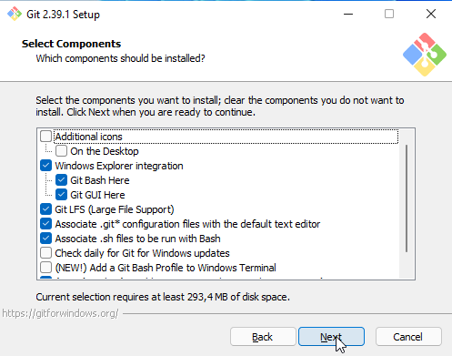
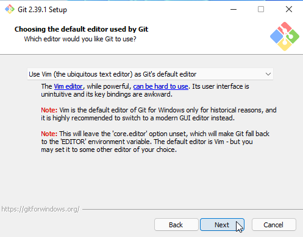
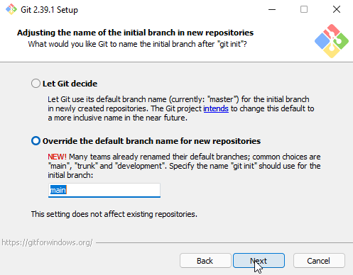
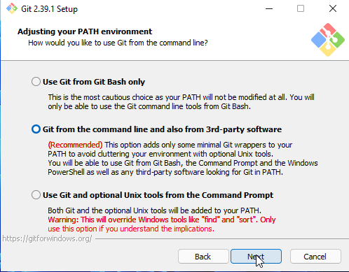
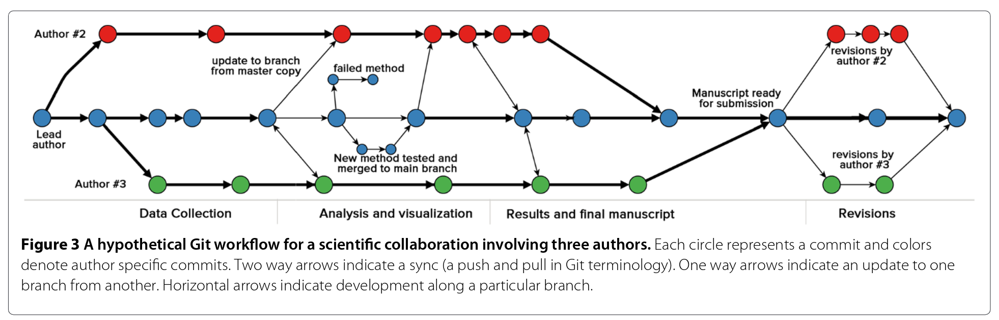

# Índice



# Introdução

A lição pretende caracterizar sistemas de controle de versões, tendo o Git como exemplo, e analisar as possibilidades de seu uso para a pesquisa em História. Para tanto, pretende-se apresentar detalhadamente as principais funções e recursos do Git para o controle de versões localmente, desde a configuração inicial do programa até sua aplicação em um exemplo prático. Buscamos refletir sobre como seu uso pode consolidar práticas conscientes de registo, controle e recuperação das operações metodológicas de uma pesquisa. Pretendemos demonstrar que o fluxo de trabalho em ramos (branches), o histórico de alterações e as mensagens relacionadas a cada mudança (commits) constituem um conjunto de funcionalidades profundamente alinhadas com um procedimento metodológico rigoroso e sofisticado, fundamental para o desenvolvimento de pesquisas em humanidades que lidam com qualquer tipo de dado - especialmente os dados digitais.

Para essa lição, vamos criar um repositório local intitulado `projeto-de-pesquisa/`. Nesse repositório serão criados os ficheiros necessários para o controle de versões com Git. Buscando analisar os recursos, possibilidades e limitações do Git, criaremos exemplos variados de ficheiros de texto simples (.csv, .txt, .md) e ficheiros compactados (.docx, .pdf, xlsx, .png), além de diretórios aninhados no interior do repositório.

# Pré-requisitos

Computador ligado à internet. Terminal (Linux e Mac) ou Git Bash (Windows).

# Objectivos de aprendizagem

No final deste tutorial os participantes devem estar aptos a:
	- Compreender os sistemas de controle de versões e suas implicações metodológicas para a pesquisa;
	- Aplicar as funcionalidades básicas do fluxo de trabalho do Git a ficheiros variados;
	- Desenvolver metodologia consistente de registo e documentação das etapas da pesquisa através do Git.

# Sistema de Controle de Versões (SCV) como ferramenta metodológica

Quem nunca passou por isso?



É bastante comum em nosso processo de escrita alterar ficheiros constantemente. Inclusões, exclusões, revisões acompanham nosso trabalho acadêmico. Não apenas ao escrevermos um manuscrito, mas também durante a elaboração e execução de projetos de pesquisa: incluímos fontes digitalizadas, imagens, criamos documentos com ideias e fragmentos de análises, geramos planilhas e bancos de dados, etc.

Todos esses procedimentos são modificados ao longo do tempo a partir de escolhas e decisões construídas no decorrer da pesquisa. É fundamental que essas alterações sejam registradas, organizadas e preservadas para o futuro: seja para a sua própria pesquisa e processo de escrita, seja para a avaliação de pares ou os desdobramentos futuros em novas pesquisas.

Portanto, é importante termos algum método explícito para controlar as diferentes versões de nosso trabalho. E de certa forma, cada um de nós tende a desenvolver caminhos para manter esse registro. Contudo, esses métodos costumam ser pouco formalizados e sem uma documentação precisa que possibilite que outros pesquisadores possam compreender o processo de desenvolvimento de uma pesquisa [(Ram et al, 2013, p2)](https://doi.org/10.1186/1751-0473-8-7). Existem várias formas de realizar um controle e registro eficiente dos caminhos de uma pesquisa. James Baker, na lição [Preservar os seus dados de investigação](https://programminghistorian.org/pt/licoes/preservar-os-seus-dados-de-investigacao) apresenta maneiras de documentar e estruturar dados de pesquisa que também servirão de inspiração aqui, sobretudo a importância de uma documentação "que capture de maneira precisa e consistente o conhecimento tácito em torno do processo de pesquisa" e a utilização de "formatos de ficheiro e práticas de notação independentes da plataforma e legíveis por máquina".

## O que é um sistema de controle de versões?

Entretanto, ao invés de criarmos um método do zero, proponho aqui a utilização de uma categoria de programas criada especificamente para o registro das alterações em ficheiros, os Sistemas de Controle de Versão (*SCVs*): consiste em um sistema que registra as mudanças de um ficheiro ou conjunto de ficheiros ao longo do tempo, cada uma dessas mudanças é acompanhada de um conjunto de metadados, e te permite recuperar tanto esses dados quanto o estado em que se encontrava o seu projeto há época.

É como se você possuísse uma máquina do tempo capaz de te levar de volta a qualquer ponto da história de mudanças da sua pesquisa.

O uso de SCVs é mais comum entre desenvolvedores de códigos e programas de computador. Entretanto, suas características o colocam como uma importante ferramenta para as ciências humanas e sociais: ao utilizar um SCV você é capaz de acompanhar, documentar, recuperar e corrigir as etapas do projeto de pesquisa. Também é possível acompanhar a trabalhos de alunos ou equipe que compõe um projeto [(Guerrero-Higueras et al., 2020, p. 2)](https://www.mdpi.com/2076-3417/10/4/1492).

<div class="alert alert-warning">
 Existe uma lição que faz referência e explica os SCVs no Programming Historian em inglês, porém a mesma está retirada. A lição estava centrada na utilização do Github Desktop, aplicativo que não é mais mantido. A lição pode ser acessada [aqui](http://programminghistorian.org/en/lessons/retired/getting-started-with-github-desktop) e possuiu informações importantes que devem ser consideradas. Entretanto, aqui, busco apresentar o básico sobre Git sem a necessidade de outras ferramentas, apresentando sua lógica e fluxo de trabalho. Dominar esses elementos permite que a utilização de plataformas como GitHub e o uso do Git em IDEs, como VS Code e RStudio, sejam mais eficientes.
</div>

### Centralizado X Distribuído

Os primeiros SCVs possuíam um modelo centralizado. Ou seja, o repositório principal era hospedado em um único servidor que armazenava todos os ficheiros versionados. Quem trabalhava no projeto enviava e recuperava todas as informações diretamente no servidor central. Esse sistema possui algumas vantagens, como a capacidade dos administradores em controlar e filtrar os acessos e atribuições de cada membro da equipe e todos conseguem saber esses papéis. (Chacon e Straub, 2014, p. 11 - 12). 

Porém, as desvantagens principais consistem justamente no seu caráter centralizado: caso o servidor tenha algum problema, todo os dados podem ser perdidos, visto que toda a história do projeto está preservada em apenas um local.



Os SCVs distribuídos têm outra abordagem. Nas palavras de Chacon e Strauv, "cada clone [de um repositório de SCV distribuído] é realmente um *backup* completo de todos os dados" (Chacon e Straub, 2014, p. 12)



## O que é o Git?

O Git é um desses SCVs distribuído. Foi criado em 2005 por Linus Torvalds[^torvalds] e [atualmente é o mais popular do mundo](https://survey.stackoverflow.co/2022/#section-version-control-version-control-systems). Ele é um software livre e gratuito, com uma grande comunidade de usuários e documentação extensa e detalhada. O Git "gerencia a evolução de um conjunto de ficheiros - chamado repositório ou repo - de uma forma sã e altamente estruturada" (Bryan, 2018, p. 2, tradução minha). Todas as mudanças são registradas (*commits*) assim como um conjunto de metadados para cada *commit*: identificação única, autoria, mensagem e data. O que permite a compreensão geral da história do desenvolvimento de um projeto (Kim et al., 2021, p. 657). 

O Git compreende seus dados como "uma série de snapshots de um sistema de arquivos em miniatura", ou seja, toda vez que você submete uma alteração ao repositório, o "Git basicamente tira uma fotografia de como todos os seus ficheiros são naquele momento e armazena uma referência para aquele snapshot" (Chacon e Straub, 2014, p. 15). Se um ficheiro não foi modificado, o Git não o armazenará novamente, apenas cria um link atualizado para ele, o que o torna mais leve e rápido. Essas características garantem a integridade do Git, visto que é impossível alterar o conteúdo de qualquer ficheiro ou diretório sem o Git saber (Chacon e Straub, 2014, p. 15). Praticamente todas essas operações acontecem localmente, minimizando problemas relativos à conexão com servidores, violação de dados e segurança.

Portanto, o Git também favorece o trabalho em equipe, pois cada membro de um projeto ao mesmo tempo em que tem acesso a todo o histórico de mudanças também pode empreender alterações específicas em seu repositório local e posteriormente submetê-lo a repositórios remotos, hospedados em servidores ou plataformas on-line como o  GitHub[^github].

Apesar dessas vantagens, é importante refletir sobre as limitações do Git. A primeira questão é a curva de aprendizagem elevada em comparação com outros programas. Apesar de possuir uma série de IDEs e programas que trazem interfaces gráficas para sua utilização, o Git é um programa de linha de comando e compreender seus principais recursos e aplicá-los de forma correta e eficiente requer a dedicação de horas de estudo e prática.

O git também apresenta dificuldades de lidar com arquivos compactados (como arquivos em formato PDF, DOCX, etc), pois ele não é capaz de diferenciar as mudanças internas desses documentos. Ou seja, o git será capaz de perceber que o arquivo foi alterado, mas não poderá listar as diferenças, como faria em arquivos de texto simples, como txt, LaTex, md, csv, json, etc. Ainda assim, o Git apresenta mais vantagens para acompanhar as mudanças em ficheiros em formatos gerados pelo Microsoft Word do que a utilização do *track changes*, por exemplo, visto que os registros das alterações desaparecem após serem resolvidas. No Git elas permanecerão, mas em outros arquivos no histórico, podendo ser recuperadas e reestabelecidas a qualquer momento.

Também é necessário atentar para o armazenamento de ficheiros muito grandes e que não mudam constantemente. Eles podem gerar históricos muito pesados e nesse caso é recomendado a exclusão desses ficheiros do histórico, mantendo apenas o registro de mudanças nos metadados (Ram, 2013, p. 6)[^gitignore]. 

## Usando o Git

Se você ainda está aqui, acredito que esteja pelo menos interessado em utilizar o Git, mesmo após essa longa e complexa introdução. Vamos agora utilizar o Git e refletir sobre as possibilidades para o seu uso em pesquisas e projetos de história.

### Fluxo de trabalho

Podemos resumir o fluxo de trabalho básico do Git da seguinte forma, a partir de Chacon e Straub (2014):

1. Você modifica algum ficheiro no seu diretório de trabalho (*working tree*);
2. Você seleciona as mudanças que pretende submeter para o histórico do Git (ou o *repositório local*);
3. Envia as mudanças para a área de preparação (*staging area*);
4. Você realiza a submissão (*commit*), incluindo uma mensagem explicativa associada às mudanças realizadas.
5. O Git então pega os ficheiros exatamente como estão na área de preparação(*staging area*) e armazena esse *snapshot* permanentemente no seu repositório local do Git, juntamente com o conjunto de metadados associado ao *commit*.

Com isso, é possível recuperar e analisar todos os passos realizados por você desde a criação do repositório local até o presente.

### Instalação

#### Windows

Para instalar o Git no Windows, acesse esse [link](https://git-scm.com/download/win) e baixe a versão mais recente do arquivo executável correspondente a arquitetura do seu computador (provavelmente 64-bits). Após a conclusão do download, clique com o botão direito do mouse no arquivo executável e selecione a opção "Executar como Administrador".

É preciso aceitar os termos de uso e definir a pasta de instalação. Em seguida, é possível definir os componentes que serão instalados e se serão adicionados ícones no menu iniciar. 



Na sequência o git pergunta qual será seu editor de texto padrão (eu manterei o *Vim*[^vim], mas você pode escolher o de sua preferência).



A próxima opção é sobre o padrão de nomeação dos *branches* em novos repositórios[^branches]. Escolheremos a opção *Override the default branch name for new repositories* e definiremos o nome do branch principal como *main*[^mainvmaster].



Por fim, é importante definir que o git será incluído no PATH do sistema, para que possa ser executado a partir de qualquer diretório. Para isso vamos escolher a segunda opção, *Git from the command line and also from 3rd-party software*



As seguintes opções manteremos como padrão, e clicaremos "Next" até a tela com a opção "Instalar".

#### Linux/MacOS

A instalação do Git em sistemas Linux e MacOs é muito simples, mas ao mesmo tempo nos oferece menos opções de configuração e é feita diretamente pelo terminal[^terminal], sem o auxílio de uma interface gráfica.

Muitas distribuições Linux já vem com o Git instalado. Ainda assim, é muito fácil instalá-lo a partir do seu gerenciador de pacotes. Por exemplo, em distribuições baseadas no Debian/Ubuntu, a última versão estável pode ser instalada executando o seguinte comando no terminal:

```bash
~$ sudo apt install git
```

Para uma lista completa de comandos para variadas distribuições Linux, [clique aqui](https://git-scm.com/download/linux).

Assim, como Linux, a instalação do git no MacOs pode ser realizada de maneira simples com seu gerenciador de pacotes. Para instalar utilizando [homebrew](https://brew.sh/), basta executar o seguinte comando no terminal:

```bash
~$ brew install git
```

Para instalar utilizando [MacPorts](https://www.macports.org/), o comando é o seguinte:

```bash
~$ sudo port install git
```

Para informações gerais e mais opções de instalação no MacOs, [clique aqui](https://git-scm.com/download/mac).

Após concluída a instalação, podemos perguntar ao nosso sistema qual versão do Git temos instalada. Para Linux e MacOs, abra o terminal e para Windows, abra o Git Bash. Em seguida, digite o seguinte comando:

```bash
~$ git --version
```

No meu computador, a informação retornada foi a seguinte:

```bash
git version 2.34.1
```

Todas as ações dessa lição serão realizadas a partir de comandos diretamente no terminal de um sistema operacional Linux, pois o objetivo aqui é apresentar o Git a partir de sua base, sem a necessidade de outros programas. Isso é importante para que a lógica do programa, seu fluxo de trabalho e possibilidades de uso sejam compreendidas de forma completa.

Então, abra seu terminal, no Linux ou no MacOs, ou o Git Bash no Windows, e vamos começar!

### Configuração Global

É importante configurar o Git com os dados de autoria e e-mail. Com essas informações, o Git é capaz de registrar quem realizou as alterações em dado momento. Neste tutorial, aprenderemos como definir essas informações globalmente para o computador utilizado. O Git possui um arquivo de configuração intitulado `.gitconfig`. Ele armazena uma série de informações importantes, como autoria, e-mail, padrões de nomeação, editor de texto a ser utilizado[^edit]. Para definir o nome do autor e o e-mail, é necessário executar os seguintes comandos:

- Autor

```bash
~$ git config --global user.name "Edward Palmer Thompson"
```

- Email

```bash
~$ git config --global user.email epthompson@hist.com
```

Esses comandos estão solicitando que o Git acesse o arquivo de configuração global (`git config`). Em seguida passamos a opção `--global`, definindo que as configurações valem para todos que utilizarem esse computador; por fim indicamos qual parâmetro queremos alterar, nesse caso, nome e e-mail do autor: `user.name` e `user.email`.

- Configurar o editor de texto: o Git permite a definição do editor a ser utilizado para a escrita das mensagens de *commit*. Por padrão, o Git utilizará o editor padrão do seu sistema operacional. No meu exemplo, definirei o Vim como editor padrão.

```bash
~$ git config --global core.editor "vim"
```

Também é possível definir o nome do branch principal para novos repositórios. Aqui, seguindo o padrão adotado com maior frequência atualmente, vamos definí-lo como *main*.

```bash
~$ git config --global init.defaultbranch main
```

Lembrando que no Windows, o processo de instalação do Git já nos permitiu configurar o editor de texto e o nome do branch principal. Caso queira alterar essas configurações, basta executar os comandos acima no Git Bash.

Você pode listar todas as configurações globais do seus computador com o comando `git config --global --list`.

Uma saída parecida com essa deve ser exibida em sua tela:

```bash
user.name=Edward Palmer Thompson
user.email=epthompson@hist.com
init.defaultbranch=main
core.editor=vim
```

### Iniciar um repositório local Git

Nessa lição, vamos criar um diretório vazio em nossa máquina chamado `projeto-de-pesquisa`. É nele que você vai testar os comandos do Git e acompanhar seu fluxo de trabalho. Para isso, você deve abrir o seu Terminal, no Linux e MacOS, ou Git Bash no Windows e criar o diretório no caminho que escolher. Por exemplo, se você pretende criar o diretório `projeto-de-pesquisa` no interior do diretório `Documentos`, você deve utilizar o comando `cd` (*change directory*) e especificar esse caminho. Sobre os comando básicos que serão utilizados aqui, como `cd`, `mkdir`, etc, veja a [lição do  Programming Historian sobre Bash](https://programminghistorian.org/en/lessons/intro-to-bash).

```bash
~$ cd ~/Documentos/
```

Em seguida, você pode executar o comando para criar um diretório: `mkdir` (*make directory*) {{nome do diretório}}.

```bash
~/Documentos$ mkdir projeto-de-pesquisa
```

Agora você pode entrar no diretório recém-criado e verificar se ele está vazio, utilizando o comando `ls` (*list*).

```bash
~/Documentos$ cd projeto-de-pesquisa
~/Documentos/projeto-de-pesquisa$ ls
```

Nada deve aparecer em sua tela, pois o diretório ainda está vazio.

Para iniciar esse diretório como um repositório local Git, você deve executar o comando para inicialização: `git init`.

<div class="alert alert-warning">
 Lembrando que todos os comandos devem ser executados no interior do diretório `projeto-de-pesquisa`.
</div>

```bash
~/Documentos/projeto-de-pesquisa$ git init
Repositório vazio Git inicializado em /home/proghist/Documentos/projeto-de-pesquisa/.git/
```

A partir de agora, o seu diretório `projeto-de-pesquisa` será um repositório submetido ao controle de versões do Git. Para verificar isso, você pode executar o comando `ls -a` (*list all*), que lista todos os ficheiros e diretórios, inclusive os ocultos.

```bash
~/Documentos/projeto-de-pesquisa$ ls -a  
```

O resultado deve ser o seguinte:
    
```bash
. ..  .git
```

O comando `git init` solicitou ao Git que o diretório `projeto-de-pesquisa` recebesse uma série de arquivos e diretórios específicos para o registro e controle de alterações. Esses arquivos são ocultos, alocados no interior do diretório `.git` e tem a função de garantir que todas as modificações ocorridas no interior do diretório de trabalho sejam percebidas, registradas e apresentadas a você. O Git reúne uma série de recursos para que você possa não apenas registrar esse histórico de alterações, mas também analisá-lo, recuperá-lo, e trabalhar de forma mais coesa e segura.

A estrutura de diretórios criada pelo Git é complexa e não será abordada a fundo nessa lição. Se listarmos os ficheiros presentas na recém-criada pasta `.git`, com o comando `ls -a .git`, obteremos o seguinte resultado:

```bash
.  ..  branches  config  description  HEAD  hooks  info  objects  refs
```

Nesse conjunto de diretórios e arquivos, o Git armazena as informações sobre o repositório: desde as alterações realizadas até os dados de configuração e fluxo de trabalho.

### Comandos básicos

Após iniciar seu repositório com o comando `git init`, podemos criar um novo ficheiro e iniciar o registro das alterações. Assim poderemos compreender com mais clareza o funcionamento do programa.

Vamos criar um arquivo chamado `README.md`, com o conteúdo `# Exemplo para a lição`, no interior de nosso diretório de trabalho (*working directory*) `projeto-de-pesquisa`. Você pode fazer isso de várias formas - com editores de texto, por exemplo. Aqui utilizarei o terminal e o comando `echo`. [^echo] Você pode fazer o mesmo no Git Bash.

```bash
~/Documentos/projeto-de-pesquisa$ echo "# Exemplo para a lição" > README.md
```

Solicitei que o programa `echo` incluísse a frase *# Exemplo para a lição* no ficheiro `README.md`. Como o ficheiro ainda não existia, ele foi criado. Se você executar o comando `ls`, verá que o ficheiro foi criado com sucesso.

```bash
~/Documentos/projeto-de-pesquisa$ ls
README.md
```
  
#### Git Status

Portanto, realizamos uma alteração em nosso repositório. Vamos verificar se o Git percebeu a mudança? Para isso, executamos o comando `git status`.

```bash
~/Documentos/projeto-de-pesquisa$ git status
```

A mensagem retornada pelo Git é a seguinte:

```bash
No ramo main

No commits yet

Arquivos não monitorados:
  (utilize "git add <arquivo>..." para incluir o que será submetido)
	README.md

nada adicionado ao envio mas arquivos não registrados estão presentes (use "git add" to registrar)
```

Vamos entender o que o Git está nos dizendo. Ao passarmos o comando `status` para o Git, ele nos informa a situação atual do repositório. Nesse momento, o Git nos informa que estamos no ramo (ou *branch*) `main`: `No ramo main`. Em seguida nos informa que não existem submissões (*commits*) ainda: `No commits yet`. Mais abaixo veremos o que são *commits* e sua importância metodológica para nossas pesquisas.

Em seguida temos a mensagem: 

```bash
Arquivos não monitorados: (utilize "git add <arquivo>..." para incluir o que será submetido)
	README.md
nada adicionado ao envio mas arquivos não registrados estão presentes (use "git add" to registrar)	
```

O Git nos informa que existe um ficheiro chamado `README.md` dentro do nosso diretório de trabalho que ainda não está sendo monitorado pelo sistema de controle de versões. Ou seja, o ficheiro ainda precisa ser adicionado ao repositório Git para que as alterações efetuadas nele sejam registradas.

#### Git Add

O próprio Git nos informa o comando que devemos utilizar para registrar o ficheiro: `git add <arquivo>`. No nosso caso, devemos executar o seguinte:

``` bash
~/Documentos/projeto-de-pesquisa$ git add README.md
```

Ao solicitarmos o status do repositório agora, receberemos uma mensagem diferente:

```bash
~/Documentos/projeto-de-pesquisa$ git status
No ramo main

No commits yet

Mudanças a serem submetidas:
  (utilize "git rm --cached <arquivo>..." para não apresentar)
	new file:   README.md
```

Mais uma vez percebemos que estamos no ramo `main` e ainda não realizamos nenhuma submissão (*commits*) para esse ramo. Entretanto, não existem mais ficheiros no estágio *não monitorados* (*untracked files*). Nosso ficheiro `README.md`mudou de status, agora está como um novo ficheiro (*new file*) no estágio `Mudanças a serem submetidas` (*Changes to be commited*).

[Explicar: `git rm --cached <arquivo>`. remove do index do git, mas mantém o arquivo no seu diretório de trabalho.]

#### Git Commit

>Commits serve as checkpoints where individual files or an entire project can be safely reverted to when necessary. (Ram, 2013, p. 2)

Agora, as alterações que realizamos estão preparadas para serem submetidas (*commited*) ao repositório. Para isso, usamos o comando `git commit`. É importante destacar a necessidade de incluir uma mensagem para cada *commit*. São essas mensagens que servirão de base para a documentação de cada etapa do seu projeto de pesquisa. Ou seja, todas as alterações realizadas e selecionadas por você para serem registradas na linha do tempo gerenciada pelo Git deverão receber uma mensagem explicativa sobre tais alterações. Esse procedimento permite tanto a criação de um histórico detalhado das mudanças e decisões, suas razões e sentidos, como fomenta uma metodologia organizada e controlada, visto que cada passo tomado deve receber uma reflexão por parte do pesquisador.

Existem duas formas de incluir uma mensagem ao commit. A primeira delas é mais simples e realizada diretamente no comando `commit`:

```bash
~/Documentos/projeto-de-pesquisa$ git commit -m "Commit inicial"

[main (root-commit) 861b527] Commit inicial
 1 file changed, 1 insertion(+)
 create mode 100644 README.md
```

Nesse caso, adicionamos a opção `-m` (de mensagem) ao comando `commit` e em seguida passamos o conteúdo da mensagem entre aspas duplas (`"`). Essa opção é mais prática, mas possui limitações: impossibilidade de criar mensagens mais detalhadas, maiores do que 50 caracteres e com quebras de linha.

Se desejarmos uma mensagem mais elaborada - o que para os objetivos dessa lição, é mais coerente -, utilizamos o comando `git commit`, sem a inclusão da opção `-m`. Nesse caso, o Git abrirá o editor de texto definido em suas configurações para que possamos escrever a mensagem. 

Como já havíamos realizado o commit das alterações antes e não realizamos nenhuma nova mudança, se executarmos o comando `git commit`, o Git nos informa que não há nada a ser submetido:

```bash
~/Documentos/projeto-de-pesquisa$ git commit

nothing to commit, working tree clean
```

Mas se ainda assim quisermos corrigir a mensagem do último commit, podemos utilizar a opção `--amend`:

```bash
~/Documentos/projeto-de-pesquisa$ git commit --amend
```

O Git abrirá o editor de texto para que possamos editar a mensagem do último *commit*. Após a edição, basta salvar e fechar o editor. No meu caso, o editor é o `vim`. Para sair do editor, basta digitar `ESC + :wq` e pressionar a tecla `Enter`.[^vim] É importante destacas que ao configurar a mensagem de commit com o editor de texto, é possível definir o título e o corpo da mensagem. 

O git considera a primeira linha da mensagem como título, e ele deve ter no máximo 50 caracteres. O restante da mensagem é considerado o corpo e deve ser separado do título por uma linha vazia. Como no exemplo abaixo:

```bash
Criação de README.md

Este commit cria o arquivo README.md com o objetivo de explicar o funcionamento do Git.
```

Após salvar e fechar o editor, o Git nos informa que o commit foi realizado com sucesso:

```bash
[main 93a5660] Criação de README.md
 Date: Thu Jan 5 11:47:12 2023 +0000
 1 file changed, 1 insertion(+)
 create mode 100644 README.md
```

Pronto, criamos nosso ficheiro `README.md` e o adicionamos ao repositório Git com sucesso. Para isso, utilizamos o comando `git add` para adicionar o ficheiro ao *index* do Git [^git-index], e o comando `git commit` para submeter as alterações ao repositório. Vimos também como incluir a mensagem de *commit* diretamente na linha de comando (`git commit -m "mensagem"`) e como editar a mensagem do último *commit* (`git commit --amend`).

Se executarmos git status novamente, veremos que não há mais nada a ser submetido:

```bash
~/Documentos/projeto-de-pesquisa$ git status

No ramo main

nothing to commit, working tree clean
```

### Estágios de um arquivo

Agora que já sabemos como adicionar um ficheiro ao repositório Git e como submeter alterações acompanhadas de mensagens, vamos detalhar e analisar os diferentes estágios de um arquivo no Git. Para isso vamos criar um arquivo novo chamado `resumo.txt` e salvá-lo no diretório `projeto-de-pesquisa`. Utilizarei o mesmo método que utilizei para criar o arquivo `README.md`, utilizando o comando `echo`, mas você pode criar esse ficheiro utilizando qualquer outro método:

```bash
~/Documentos/projeto-de-pesquisa$ echo "Resumo" >> resumo.txt
```

Se listarmos o conteúdo do diretório `projeto-de-pesquisa` veremos que agora existem dois ficheiros:

```bash
~/Documentos/projeto-de-pesquisa$ ls
README.md  resumo.txt
```

Como vimos anteriormente, um ficheiro recém criado em nosso diretório de trabalho se encontra no estágio **não monitorado** (*untracked*) e precisa ser **preparado** (*staged*) para ser **submetido** (*commited*). Podemos ver sua situação com um `git status`.

```bash
~/Documentos/projeto-de-pesquisa$ git status
No ramo main
Arquivos não monitorados:
  (utilize "git add <arquivo>..." para incluir o que será submetido)
	resumo.txt

nada adicionado ao envio mas arquivos não registrados estão presentes (use "git add" to registrar)

```
Ou seja, o ficheiro `resumo,txt` está no estágio **não monitorado** (*untracked*) e precisa ser **preparado**(*staged*). Para preparar o ficheiro, utilizamos `git add <nome do ficheiro>`. Ou seja, estamos solicitando ao Git que ele inclua o ficheiro no *index*.

```bash
~/Documentos/projeto-de-pesquisa$ git add resumo.txt
```

A partir do momento que o ficheiro foi registrado (*staged*) no Git, ele muda de estágio e está pronto para ser submetido (*commit*), como podemos ver executando um `git status`.

```bash
~/Documentos/projeto-de-pesquisa$ git status
No ramo main
Mudanças a serem submetidas:
  (use "git restore --staged <file>..." to unstage)
	new file:   resumo.txt
```

Ou seja, `resumo.txt` é um novo ficheiro que está pronto para ser submetido ao Git. 

```bash
~/Documentos/projeto-de-pesquisa$ git commit 
```

O editor de texto será aberto e você pode inserir a mensagem, por exemplo, "Criação do ficheiro para o resumo do tutorial". Após salvar e fechar o editor, o Git nos informa que o commit foi realizado com sucesso:

```bash
[main 48f3c9d] Criação do ficheiro para o resumo do tutorial
 1 file changed, 1 insertions(+)
 create mode 100644 resumo.txt
```

A mensagem retornada nos informa que um ficheiro foi alterado, e uma inserção realizada em seu conteúdo.

A partir de agora, o ficheiro `resumo.txt`, assim como o `README.md`, está inserido no repositório Git que realiza o controle de versões, ou seja, registra e avalia todas as mudanças que são realizadas. 

Vamos alterar o conteúdo dos dois ficheiros para entendermos esse processo.

Primeiro vamos inserir uma frase no ficheiro `resumo.txt`. Para isso você pode abri-lo em qualquer editor de texto, escrever a frase "Esse tutorial pretende apresentar as funções básicas do Git." e salvá-lo. Depois, abra o ficheiro `README.md` e inclua a frase "Lição para o Programming Historian", salvando em seguida. Realizamos alterações em dois ficheiros do nosso diretório de trabalho, ambos registrados e monitorados pelo Git. Vejamos quais informações o comando *status* nos apresenta:

```bash
~/Documentos/projeto-de-pesquisa$ git status
No ramo main
Changes not staged for commit:
  (utilize "git add <arquivo>..." para atualizar o que será submetido)
  (use "git restore <file>..." to discard changes in working directory)
	modified:   README.md
	modified:   resumo.txt

nenhuma modificação adicionada à submissão (utilize "git add" e/ou "git commit -a")
```

A mensagem informa que dois ficheiros foram modificados e ainda não foram preparados para submissão (*changes not staged for commit*). Para inserir essas mudanças e prepará-las para o *commit*, devemos utilizar o comando `git add <nome do ficheiro>`. É possível incluir mais de um ficheiro no mesmo comando, por exemplo:

```bash
~/Documentos/projeto-de-pesquisa$ git add README.md resumo.txt
```

É possível especificar que todos os ficheiros presentes no diretório de trabalho sejam preparados ao mesmo tempo, utilizando `git add .`.

Agora que preparamos as mudanças para submissão, os ficheiros aparecem com o status **Mudanças a serem submetidas** (*Changes to be commited*):

```bash
~/Documentos/projeto-de-pesquisa$ git status
No ramo main
Mudanças a serem submetidas:
  (use "git restore --staged <file>..." to unstage)
	modified:   README.md
	modified:   resumo.txt
```

Para submeter essas mudanças é preciso utilizar o comando *commit*. Podemos fazer um único commit para as mudanças em todos os ficheiros e escrever uma mensagem detalhada. Por exemplo:

```bash
~/Documentos/projeto-de-pesquisa$ git commit
# o editor de texto padrão do sistema operacional será aberto e você poderá escrever a mensagem
```

```vim
Atualização dos dados da lição

- Inclusão de autoria no README.md
- Atualização do texto em resumos.txt

# Please enter the commit message for your changes. Lines starting
# with '#' will be ignored, and an empty message aborts the commit.
#
# No ramo main
# Mudanças a serem submetidas:
#       modified:   README.md
#       modified:   resumo.txt
#
``` 

Após salvar e fechar o editor, o Git nos informa que o commit foi realizado com sucesso:

```bash
[main 572f33f] Atualização dos dados da lição
 2 files changed, 2 insertions(+)
```

Resumindo: toda vez que um novo ficheiro for criado ele precisa ser preparado (`git add`) e submetido (`git commit`), as submissões devem vir acompanhadas de uma mensagem explicativa sobre o que foi feito. Cada alteração realizada em qualquer ficheiro presente no diretório de trabalho que já esteja sendo monitorado pelo Git deve ser também preparada e submetida com uma mensagem clara e explicativa. É possível consultar a condição do diretório de trabalho com o `git status`, o que nos possibilita perceber com clareza quais ficheiros são novos, quais estão modificados, quais estão preparados ou não para submissão.

## Como escrever uma mensagem de *commit* eficiente?

Parte significativa do nosso trabalho de pesquisa, escrita e ensino atualmente é mediado por ferramentas digitais, ao mesmo tempo que dados digitais se tornam cada vez mais centrais para as Ciências Sociais e Humanas. Sejam buscas on-line em repositórios, trocas de mensagens por aplicativos, leitura de informações com editores de texto e planilhas, seja a aplicação de linguagem de programação para análise textual, visualização de dados entrou tantas outras possibilidades. A seleção, coleta, organização e tratamento dos dados que pretendemos utilizar em pesquisa, artigos ou aulas nos demanda atualmente cuidados diferentes e adicionais daqueles para os quais fomos treinados em nossa formação anterior à virada digital. Nas palavras de Fridlunnd, Oiva e Paju:

>Os métodos de pesquisa digital criam demandas novas e às vezes mais rigorosas de precisão, pensamento metodológico, auto-organização e colaboração do que a pesquisa histórica tradicional" (FRIDLUND; OIVA; PAJU, 2020, pos. 543).

Um caminho importante na busca de sanar essas novas demandas, é a transparência metodológica. Nas palavras de Gibbs e Owens:

>novos métodos usados para explorar e interpretar dados históricos exigem um novo nível de transparência metodológica na escrita histórica. Exemplos incluem discussões de consultas de dados, fluxos de trabalho com ferramentas específicas e a produção e interpretação de visualizações de dados. No mínimo, as publicações de pesquisa dos historiadores precisam refletir novas prioridades que explicam o processo de interfacear, explorar e, em seguida, compreender as fontes históricas de uma forma fundamentalmente digital - ou seja, a hermenêutica dos dados. (Gibbs e Owens, 2013: 159)

É fundamental criar um plano para organização, documentação, preservação e compartilhamento dos dados, métodos e resultados da pequisa.

Veja essa lição de James Backer sobre preservação dos dados de investigação para outras estratégias e referências.

- Metadados (como você descreve seus dados, tanto internamente quanto externamente)
- Documentação (uma descrição narrativa do projeto)
- Preservação (como os dados podem ser mantidos para uso no futuro)

Podemos enfrentar boa parte desses desafios utilizando programas de controle de versões, como o git.

- Controle de versões (o que fazer se você fizer uma  lambança no processo)

Encarar o processo de documentação como um processo público, mesmo que não seja publicado.

Baker: https://programminghistorian.org/pt/licoes/preservar-os-seus-dados-de-investigacao

>- Fazer documentação que capture de maneira precisa e consistente o conhecimento tácito em torno do processo de pesquisa, seja em relação às notas, geração de dados ou acumulação de evidências visuais.
>-Simplificar o processo de documentar, usando formatos de ficheiro e práticas de notação independentes da plataforma e legíveis por máquina.
>- Criar tempo para atualizar e documentar o fluxo de trabalho sem permitir que o trabalho de documentação se torne um fardo.
>- Investir para deixar um rasto de papel agora e economizar tempo na tentativa de reconstruí-lo no futuro.

Ao escrever uma mensagem de *commit* lembre-se que ela servirá como documentação do seu processo de pesquisa/escrita. Cada alteração ou conjunto de alterações realizada nos ficheiros de seu diretório deve vir acompanhada de uma mensagem que registre as mudanças efetuadas. Essas informações são registradas pela Git com um conjunto de metadados importantes para o acompanhamento metodológico de seu trabalho: nome do autor da mudança, data e hora, mensagem e uma identificação única - uma *hash* de 40 caracteres - que permite a identificação da versão do arquivo.

A melhor forma de escrever a mensagem de *commit* é utilizar `git commit` sem a opção `-m`, pois nos permite escrever mensagens mais  longas do que 50 caracteres (limite da opção `-m`) e incluir quebras de linha e um título para nossa mensagem. Como descrito anteriormente, o `git commit` abre o editor de texto padrão do seus sistema operacional - ou o editor que você configurou no git - para que você possa escrever a mensagem de *commit*.

No meu caso, o editor é o vim, e a mensagem de *commit* ficaria assim:

```vim
Título da mensagem de commit

Descrição da mensagem de commit
# Please enter the commit message for your changes. Lines starting
# with '#' will be ignored, and an empty message aborts the commit.
#
# No ramo main
# Mudanças a serem submetidas:
#    modified:   resumo.txt
#
```

Após escrever a mensagem, salve o arquivo e feche o editor. A mensagem de *commit* será registrada no repositório local.

### Recuperando informações

[Importância para o processo metodológico]
#### git log

>Git commit logs can provide a highly granular way to track and assess individual author contributions to a project. When projects are tracked using Git, every single action (such as additions, deletions, and changes) is attributed to an author. (Ram, 2013, p. 3)


Para recuperarmos as informações submetidas ao repositório local, podemos utilizar o comando `git log`. Esse comando será muito útil para acessarmos as informações sobre o histórico de alterações em nossos ficheiros e avaliarmos o progresso do trabalho.

```bash
~/Documentos/projeto-de-pesquisa$ git log
commit 572f33fbe94ee6612b29be5bbee81d6672c162fa (HEAD -> main)
Author: Edward Palmer Thompson <epthompson@hist.com>
Date:   Thu Jan 5 12:01:16 2023 +0000

    Atualização dos dados da lição
    
    - Inclusão de autoria no README.md
    - Atualização do texto em resumos.txt

commit 48f3c9d3e7e419de8f29a58211dc7e97957c7b2f
Author: Edward Palmer Thompson <epthompson@hist.com>
Date:   Thu Jan 5 11:50:41 2023 +0000

    Criação do ficheiro para o resumo do tutorial

commit 93a56606662ee3f37846d9623fb03d29b2f21135
Author: Edward Palmer Thompson <epthompson@hist.com>
Date:   Thu Jan 5 11:47:12 2023 +0000

    Criação de README.md
    
    Este commit cria o arquivo README.md com o objetivo de explicar o funcionamento do Git.
```

Podemos perceber que o `git log` nos retorna a lista de commits realizados no repositório local. Os nossos três commits estão detalhados com várias informações importantes. A primeira coisa a se notar é que os commits são listados do mais recente para o mais antigo. Assim, o último commit realizado é o primeiro da lista. Vamos analisá-lo com mais atenção.

Em sua primeira linha, temos a seguinte informação:

```bash
commit 572f33fbe94ee6612b29be5bbee81d6672c162fa (HEAD -> main)
```

Encontramos o número de identificação do commit com 40 caracteres. Não se assuste, não há necessidade de ler esse número nem entender como ele é gerado para utilizar o Git. O importante é saber que cada commit possui um identificador único, possibilitando seu acesso e recuperação dentro do banco de dados do sistema de controle de versões. Na verdade, é possível utilizar os 7 primeiros caracteres para encontrar e referenciar commits específicos. Por exemplo, esse commit pode ser identificado por `572f33f` e o Git será capaz de encontrá-lo. A importância dessa identificação única para cada alteração reside justamente na posibilidade de se acessar cada mudança a qualquer momento e, inclusive, retornar o repositório para a condição que se encontrava naquele momento do tempo.

A informação que se segue também é importante, mas fará mais sentido adiante. `(HEAD -> main)` está indicando que o commit mais recente está apontando para o ramo (*branch*) *main*.  Ou seja, você está trabalhando atualmente em uma linha do tempo chamada main, e todas as mudanças que realizar incidirão sobre ela. Mais a frente veremos que é possível criar outras linhas de trabalho ou ramificações, criar alterações nos ficheiros e não afetar as informações contidas em outros ramos.

Nas duas linhas seguintes, temos a autoria e data relativa ao *commit*:

```bash
Author: Edward Palmer Thompson <epthompson@hist.com>
Date:   Thu Jan 5 12:01:16 2023 +0000
```

Os dados do autor - nome e email -  são retirados da configuração que realizamos no início da lição com o comado `git config user.name` e `git config user.mail`. A data e a hora estão no padrão do Git, mas também podem ser configuradas[^config-date].

Em seguida, podemos ler a mensagem do *commit*, sendo a primeira linha entendida pelo Git como seu título:

```bash
    Atualização dos dados da lição
    
    - Inclusão de autoria no README.md
    - Atualização do texto em resumos.txt
```

O comando `git log` possui várias opções que são úteis para acompanharmos e recuperarmos dados sobre o processo metodológico do nosso trabalho. Abaixo, veremos algumas, mas a lista completo pode ser acessada na [página de documentação do Git](https://git-scm.com/docs/git-log/pt_BR).

Podemos ver todos os commits listados em apenas uma linhas, acrescentando a opção `--oneline` ao comando `git log`, o que pode ser útil para uma leitura mais rápida e concisa das alterações:

```bash
~/Documentos/projeto-de-pesquisa$ git log --oneline
572f33f (HEAD -> main) Atualização dos dados da lição
48f3c9d Criação do ficheiro para o resumo do tutorial
93a5660 Criação de README.md
```


Com essa opção, a lista de commits do atual ao mais antigo, apresenta os sete caracteres iniciais da identificação e o título da mensagem.

Também é possível acessarmos um commit específico dessa lista, informando os sete caracteres iniciais:

```bash
~/Documentos/projeto-de-pesquisa$ git log 93a5660
commit 93a56606662ee3f37846d9623fb03d29b2f21135
Author: Edward Palmer Thompson <epthompson@hist.com>
Date:   Thu Jan 5 11:47:12 2023 +0000

    Criação de README.md
    
    Este commit cria o arquivo README.md com o objetivo de explicar o funcionamento do Git.
```

Podemos acessar o histórico de um ficheiro ou diretório específico, incluindo as diferenças, com opção `-p` ou `--path`:

```bash
~/Documentos/projeto-de-pesquisa$ git log -p resumo.txt
commit 572f33fbe94ee6612b29be5bbee81d6672c162fa (HEAD -> main)
Author: Edward Palmer Thompson <epthompson@hist.com>
Date:   Thu Jan 5 12:01:16 2023 +0000

    Atualização dos dados da lição
    
    - Inclusão de autoria no README.md
    - Atualização do texto em resumos.txt

diff --git a/resumo.txt b/resumo.txt
index e69de29..bd25a49 100644
--- a/resumo.txt
+++ b/resumo.txt
@@ -0,0 +1 @@
+Resumo: Esse tutorial pretende apresentar as funções básicas do Git.

commit 48f3c9d3e7e419de8f29a58211dc7e97957c7b2f
Author: Edward Palmer Thompson <epthompson@hist.com>
Date:   Thu Jan 5 11:50:41 2023 +0000

    Criação do ficheiro para o resumo do tutorial

diff --git a/resumo.txt b/resumo.txt
new file mode 100644
index 0000000..e69de29
```
- oneline
- path
- grep
- graph
- pretty-formats
- to csv

### Fluxo de trabalho com Branches

[explicar o que é um branch]
[falar sobre o merge]




# Considerações finais

>With disciplined use of Git, individual scientists and labs can ensure that the entire timeline of events that occur over the development of a research project are securely logged in a system that provides security against data loss and encourages risk-free exploration of new ideas and approaches. (Ram, 2013, p. 6)
# Leituras adicionais

Bird, Christian, Peter C. Rigby, Earl T. Barr, David J. Hamilton, Daniel M. German, e Prem Devanbu. “The promises and perils of mining git”. Em 2009 6th IEEE International Working Conference on Mining Software Repositories, 1–10, 2009. https://doi.org/10.1109/MSR.2009.5069475.

Eric Brasil. (2022, May 20). Criação, manutenção e divulgação de projetos de História em meios digitais: git, GitHub e o Programming Historian. Zenodo. https://doi.org/10.5281/zenodo.6566754

James Baker, "Preservar os seus dados de investigação", traduzido por Márcia T. Cavalcanti, Programming Historian em português 1 (2021), https://doi.org/10.46430/phpt0001.

Bird, Christian, Peter C. Rigby, Earl T. Barr, David J. Hamilton, Daniel M. German, e Prem Devanbu. “The promises and perils of mining git”. Em 2009 6th IEEE International Working Conference on Mining Software Repositories, 1–10, 2009. https://doi.org/10.1109/MSR.2009.5069475.

Bryan, Jennifer. “Excuse Me, Do You Have a Moment to Talk About Version Control?” The American Statistician 72, nº 1 (2 de janeiro de 2018): 20–27. https://doi.org/10.1080/00031305.2017.1399928.

Chacon, Scott, e Ben Straub. Pro Git. 2º edição. Apress, 2014.

Loeliger, Jon, e Matthew McCullough. Version Control with Git: Powerful tools and techniques for collaborative software development. 2º edição. Sebastopol, CA: O’Reilly Media, 2012.

Ram, Karthik. “Git can facilitate greater reproducibility and increased transparency in science”. Source Code for Biology and Medicine 8, nº 1 (28 de fevereiro de 2013): 7. https://doi.org/10.1186/1751-0473-8-7.

---

[^terminal]: Ver a melhor forma de falar sobre ele. Indicar a lição sobre bash no PH.
[^branches]: Falaremos mais detalhadamento sobre branches e fluxo de trabalho com eles na parte dois dessa lição.
[^mainvmaster]: explicar. link sobre.
[^edit]: pode ser acessado através do comando `git config --global --edit`.
[^echo]: Explorar melhor o comando echo.
[^vim]: Ver a lição sobre o editor de texto vim.
[^config-date]: falar sobre configuração de data e hora ou linkar manual do git
[^torvalds]: quem?
[^github]: explicar
[^gitignore]: explicar